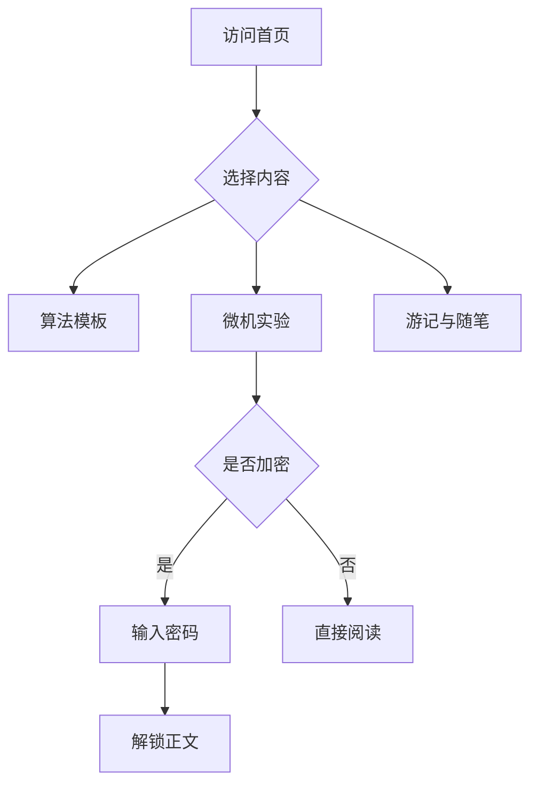
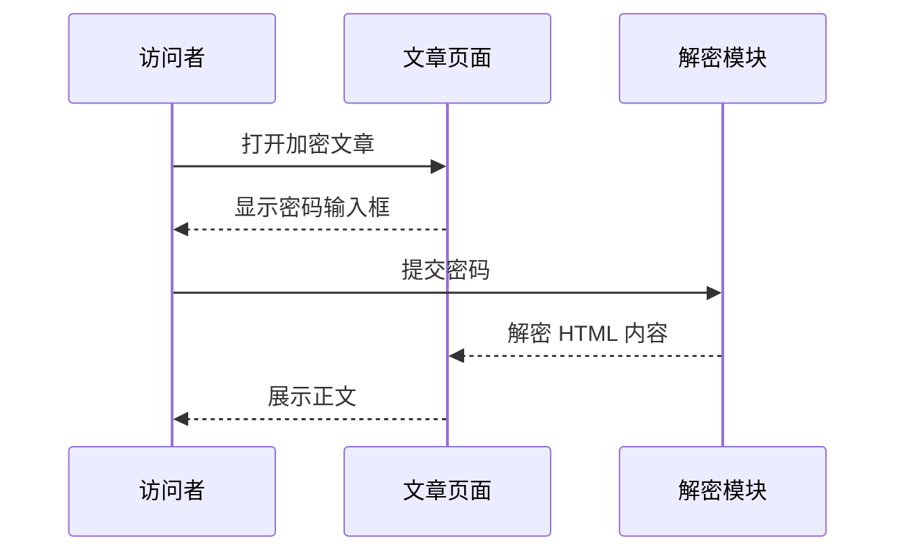
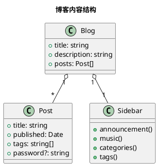

<!-- markdownlint-disable MD025 MD033 -->

# Firefly 特性展示

这篇文章用于集中测试 Firefly 主题的 Markdown 扩展能力。内容本身不追求严肃论证，重点是把常用展示组件放在同一篇文章里，方便后续复制改造。

> [!NOTE]
> 这是 GitHub 风格提醒块。适合放背景信息、阅读提示和注意事项。

:::tip{title="写作建议"}
长文章可以把“正文解释、公式推导、代码模板、流程图、参考链接”拆开呈现。这样读者更容易定位信息，也能让页面显得更有层次。
:::

## 1. 基础排版

正文支持 **加粗**、*斜体*、~~删除线~~、`inline code`，也支持链接，例如 [Astro](https://astro.build/)、[Firefly](https://github.com/CuteLeaf/Firefly) 和 [Mathison2020](https://github.com/Mathison2020)。

下面是一组任务列表：

- [x] 迁移旧博客内容
- [x] 修复数学公式渲染
- [x] 启用三栏布局和文章加密
- [ ] 继续整理算法模板文章

## 2. 表格

| 功能 | 用法 | 适合场景 |
| --- | --- | --- |
| 提醒块 | `> [!NOTE]` 或 directive | 总结、警告、提示 |
| GitHub 卡片 | `::github{repo="owner/repo"}` | 推荐项目 |
| Mermaid | ` ```mermaid ` | 流程图、状态图 |
| PlantUML | ` ```plantuml ` | 类图、时序图 |
| 图片网格 | `[grid]...[/grid]` | 相册、封面展示 |

## 3. 数学公式

行内公式示例：当 $f(x)$ 单调时，可以二分答案 $x$，再用 `check(x)` 判断可行性。

行间公式示例：

$$
\operatorname{ans}=\min_{S\subseteq \{1,\dots,n\}, |S|\le k}
\left(\max_{1\le l\le r\le n}\sum_{i=l}^{r} a_i'\right)
$$

矩阵也可以正常渲染：

$$
A=
\begin{bmatrix}
1 & 1\\
1 & 0
\end{bmatrix},
\quad
A^n=
\begin{bmatrix}
F_{n+1} & F_n\\
F_n & F_{n-1}
\end{bmatrix}
$$

## 4. 代码块

短代码片段可以强制展开：

```cpp nocollapse
int add(int a, int b) {
    return a + b;
}
```

完整程序可以加标题，并交给主题按长度自动折叠：

```cpp title="binary-search-demo.cpp"
#include <bits/stdc++.h>
using namespace std;

bool check(long long x) {
    return x * x >= 100;
}

int main() {
    long long l = 0, r = 100, ans = -1;
    while (l <= r) {
        long long mid = (l + r) >> 1;
        if (check(mid)) {
            ans = mid;
            r = mid - 1;
        } else {
            l = mid + 1;
        }
    }
    cout << ans << '\n';
    return 0;
}
```

也可以展示配置片段：

```ts nocollapse
export const featureFlags = {
  comments: false,
  randomCover: true,
  sakura: true,
  encryptedPosts: true,
};
```

## 5. GitHub 仓库卡片

::github{repo="CuteLeaf/Firefly"}

::github{repo="withastro/astro"}

## 6. Mermaid 图表





## 7. PlantUML 图表



## 8. 图片和图片网格

普通图片：


图片网格：

[grid]


[/grid]

## 9. 嵌入视频

可以直接写 HTML 嵌入在线视频。下面是一个 YouTube 示例：

<div style="position: relative; width: 100%; padding-bottom: 56.25%; margin: 1rem 0; overflow: hidden; border-radius: 1rem;">
  <iframe
    src="https://www.youtube.com/embed/dQw4w9WgXcQ"
    title="Embedded video demo"
    loading="lazy"
    allow="accelerometer; autoplay; clipboard-write; encrypted-media; gyroscope; picture-in-picture; web-share"
    allowfullscreen
    style="position: absolute; inset: 0; width: 100%; height: 100%; border: 0;"
  ></iframe>
</div>

也可以嵌入本地视频，只要文件放在 `public/` 目录下：

```html nocollapse
<video controls src="/videos/demo.mp4" poster="/gallery/firefly-2026/cover.avif"></video>
```

## 10. 折叠详情和引用

<details>
  <summary>点击查看补充说明</summary>

这里是原生 HTML 的 `details` 折叠块。它适合收纳较长的参考资料、题解提示、命令输出或额外说明。

</details>

> [!IMPORTANT]
> 页面丰富不等于组件越多越好。真正长期可维护的博客，应该让装饰服务于内容结构。

## 11. 小结

这篇文章覆盖了：

1. 基础 Markdown 排版
2. 表格、任务列表和链接
3. KaTeX 数学公式
4. Expressive Code 代码块
5. GitHub 仓库卡片
6. Mermaid 与 PlantUML 图表
7. 图片网格和视频嵌入
8. 提醒块、折叠块和引用

后续写文章时，可以从这篇里复制相应片段，再替换成真实内容。
